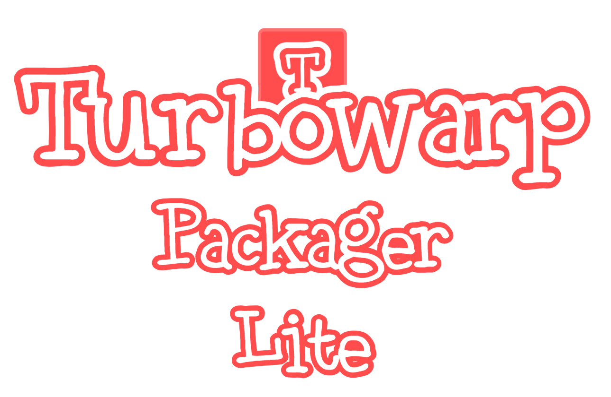

# Turbowarp Packager Lite
A lightweight version of Turbowarp Packager that allows you to convert your Scratch/Turbowarp projects to EXE without Chromium.

Using WebView2. This drastically reduces the size to smaller compared to 100MB size when using Chromium.

## How to Use
1. Convert your Scratch/Turbowarp project to plain HTML in [Turbowarp Packager](https://packager.turbowarp.org/)
2. Rename HTML file to `index.html` and move `index.html` to assets folder
3. Click `run.bat` (Windows) or `run.sh` (MacOS/Linux) and enter your Scratch/Turbowarp project
4. You can type test or compile to choose whether you want to preview or compile directly.

You're done!

## Credits
- sirthegamercoder, Owner of Turbowarp Packager Lite
- Turbowarp Team, App icon

If you find a bug, please report in Issues section!

